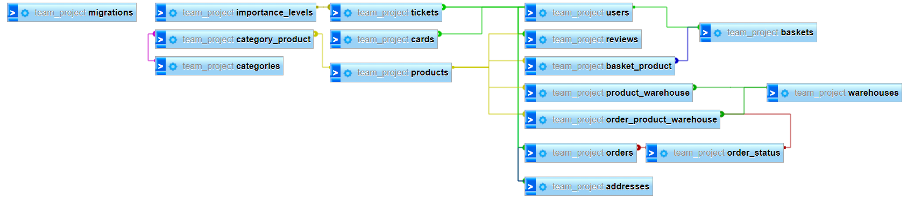

# Database
This guide goes over the contents of the database folder, how to use them, as well as the Database Schema.

## Migrations
The migrations folder contains files that define database tables used for this project, including indexes and relationships.

Any schema changes for the database can be modified here. This is also Laravel's point of reference when querying the database with Eloquent models.

**Changes aren't automatically updated in the database; you'll have to [run migration commands](#building-the-database) again.** 
- See (https://laravel.com/docs/10.x/migrations) for more information.

### Running Migrations
This will query the database, building the tables specified in migrations.
1. Ensure [.env](../.env) is modified to connect to your target database.
2. Open the [WoodLess](../../WoodLess/) folder in terminal, run `php artisan migrate`. This will create the tables in your database.

### Erasing Table Data
When modifying table columns, relations, etc... you may experience errors when running migrations again. Assuming you're only making changes in a development environment, it is best to wipe the database.
- To do this, run `php artisan db:wipe` to drop everything and repeat steps above.
- Alternatively, `php artisan migrate:fresh` will only drop table rows.

## Factories
Test data is defined in [factories](./factories/). Each file contains a method to build a model instance using [faker](https://github.com/fzaninotto/Faker) methods. 

- See (https://laravel.com/docs/10.x/eloquent-factories) for more information.

## Seeders
Seeders allow for quick seeding of data to a database.

The file [DatabaseSeeder](./seeders/DatabaseSeeder.php) contains methods to populate tables with test data, which you can use to test or demo features. Modify this file as required, but it's recommended to make multiple seeders depending on your requirements.

- See (https://laravel.com/docs/10.x/seeding) for more information.

### Running the Seeder
1. Open the [WoodLess](../../WoodLess/) folder in terminal. 
2. Next, `php artisan db:seed` to run data to the database, or `php artisan migrate:fresh --seed` to both drop all table rows and add fresh new data.

## Schema (Last Updated: 29/02/24)
See below information on the database.
### Overview

    

